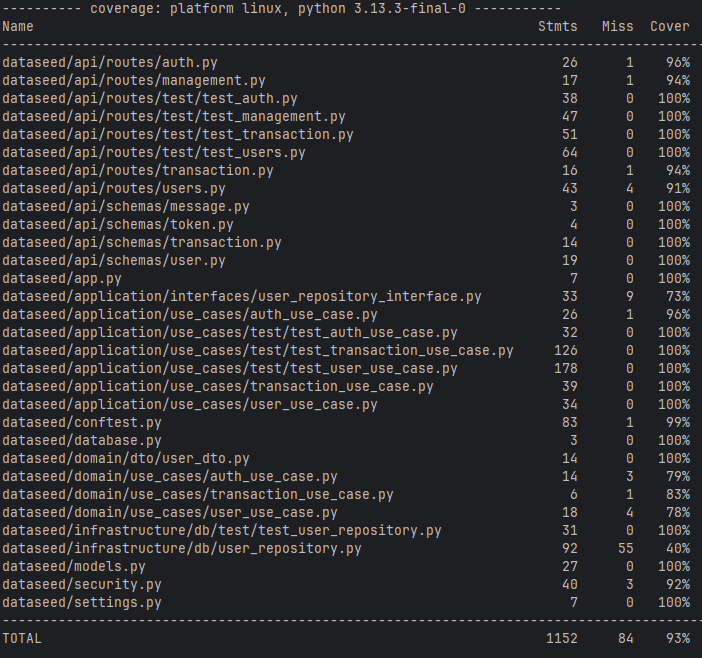

<div id="top">

<!-- HEADER STYLE: CLASSIC -->
<div align="center">

# TESTEDATASEED

<em></em>

<!-- BADGES -->


<br>


<!-- default option, no dependency badges. -->


<!-- default option, no dependency badges. -->

</div>
<br>

---

## Table of Contents

- [Table of Contents](#table-of-contents)
- [Overview](#overview)
- [Features](#features)
- [Project Structure](#project-structure)
    - [Project Index](#project-index)
- [Getting Started](#getting-started)
    - [Prerequisites](#prerequisites)
    - [Installation](#installation)
    - [Usage](#usage)
    - [Testing](#testing)
- [Roadmap](#roadmap)
- [Contributing](#contributing)
- [License](#license)
- [Acknowledgments](#acknowledgments)

---

## Overview

TesteDataseed is a secure and scalable data management application built with FastAPI, SQLAlchemy, and Alembic, designed for efficient data handling and robust authentication.

**Why TesteDataseed?**

This project simplifies data management and streamlines the development workflow for building secure and reliable applications. The core features include:

- **🟢 Secure Authentication & Authorization:**  Leverages JWT for secure user access control and robust password hashing.
- **🔵 Automated Database Migrations:**  Utilizes Alembic for seamless database schema updates and rollbacks, minimizing deployment risks.
- **🟡 Comprehensive Unit Testing:**  Extensive pytest integration ensures high code quality and reduces bugs.
- **🟠 Modular and Extensible Architecture:**  Cleanly separated modules promote maintainability and ease of future development.
- **🟣 Asynchronous Database Interactions:**  Efficient SQLAlchemy integration optimizes database access for improved performance.
- **⚫️ Clean Code & Streamlined Workflow:**  Poetry and Taskipy ensure consistent code style and automated build processes.

---

## Features

|     | Component         | Details                                                                                                                                                                                                                                                                                                                    |
|:----|:------------------|:---------------------------------------------------------------------------------------------------------------------------------------------------------------------------------------------------------------------------------------------------------------------------------------------------------------------------|
| ⚙️  | **Architecture**  | <ul><li>Uses FastAPI for the web framework.</li><li>Utilizes SQLAlchemy for database interaction (likely PostgreSQL given `psycopg` dependency).</li><li>Employs Alembic for database migrations.</li><li>Structure suggests a layered architecture (though details are limited without deeper code inspection).</li></ul> |
| 🔩  | **Code Quality**  | <ul><li>Uses `ruff` for linting, suggesting a focus on code style and potential static analysis.</li><li>`pytest` and `pytest-cov` indicate unit testing with coverage measurement.</li><li>Further assessment requires a deeper code review.</li></ul>                                                                    |
| 📄  | **Documentation** | <ul><li>Limited documentation found based on provided context.  Requires further investigation.</li></ul>                                                                                                                                                                                                                  |
| 🔌  | **Integrations**  | <ul><li>Integrates with a database (PostgreSQL likely).</li><li>Uses `pyjwt` suggesting JSON Web Token authentication/authorization.</li><li>`httpx` indicates HTTP client usage for external API interactions (if any).</li></ul>                                                                                         |
| 🧩  | **Modularity**    | <ul><li>Assessment requires a deeper code review to determine the level of modularity.</li><li>Use of `pydantic` suggests data validation and potentially a modular approach to data structures.</li></ul>                                                                                                                 |
| 🧪  | **Testing**       | <ul><li>`pytest` and `pytest-cov` are used for testing and coverage.</li><li>`pytest-asyncio` suggests asynchronous testing capabilities.</li><li>`factory-boy` likely aids in test data creation.</li><li>`testcontainers` might be used for integration testing with containers.</li></ul>                               |
| ⚡️  | **Performance**   | <ul><li>Difficult to assess without performance testing and profiling.</li><li>`gevent` suggests potential use of asynchronous programming for improved performance (though its actual usage needs verification).</li></ul>                                                                                                |
| 🛡️ | **Security**      | <ul><li>`pyjwt` for JWT authentication implies a focus on security, but further analysis is needed to assess the overall security posture.</li><li>Requires a thorough security review to identify vulnerabilities.</li></ul>                                                                                              |
| 📦  | **Dependencies**  | <ul><li>Uses `FastAPI`, `SQLAlchemy`, `psycopg`, `pydantic`, `alembic`, `pytest`, `pyjwt`, `httpx`, and others.  A comprehensive list is available in `poetry.lock`.</li></ul>                                                                                                                                             |
| 🚀  | **Scalability**   | <ul><li>Difficult to assess without further information on the application's design and deployment strategy.</li><li>The use of a database and a web framework like FastAPI provides a foundation for scalability, but further analysis is needed.</li></ul>                                                               |

---

## Project Structure

```sh
└── TesteDataseed/
    ├── LICENSE
    ├── alembic.ini
    ├── dataseed
    │   ├── api
    │   ├── app.py
    │   ├── application
    │   ├── conftest.py
    │   ├── database.py
    │   ├── domain
    │   ├── infrastructure
    │   ├── models.py
    │   ├── security.py
    │   └── settings.py
    ├── migrations
    │   ├── README
    │   ├── env.py
    │   ├── script.py.mako
    │   └── versions
    ├── poetry.lock
    ├── pyproject.toml
    └── utils.py
```

### Project Index

<details open>
	<summary><b><code>TESTEDATASEED/</code></b></summary>
	<details>
		<summary><b>__root__</b></summary>
		<blockquote>
			<div class='directory-path' style='padding: 8px 0; color: #666;'>
				<code><b>⦿ __root__</b></code>
			<table style='width: 100%; border-collapse: collapse;'>
			<thead>
				<tr style='background-color: #f8f9fa;'>
					<th style='width: 30%; text-align: left; padding: 8px;'>File Name</th>
					<th style='text-align: left; padding: 8px;'>Summary</th>
				</tr>
			</thead>
				<tr style='border-bottom: 1px solid #eee;'>
					<td style='padding: 8px;'><b><a href='https://github.com/VitorManoel0/TesteDataseed/blob/master/alembic.ini'>alembic.ini</a></b></td>
					<td style='padding: 8px;'>- It uses os/path separators and sets up SQLite+AIOSQLITE://dataseed.db as the database URL<br>- Loggers ensure database operations and migrations are properly managed.</td>
				</tr>
				<tr style='border-bottom: 1px solid #eee;'>
					<td style='padding: 8px;'><b><a href='https://github.com/VitorManoel0/TesteDataseed/blob/master/pyproject.toml'>pyproject.toml</a></b></td>
					<td style='padding: 8px;'>- Mention technologies used: Pydantic, FastAPI, SQLAlchemy, and others<br>- Include dependencies on libraries like pytest, ruff, and testcontainers<br></td>
				</tr>
				<tr style='border-bottom: 1px solid #eee;'>
					<td style='padding: 8px;'><b><a href='https://github.com/VitorManoel0/TesteDataseed/blob/master/utils.py'>utils.py</a></b></td>
					<td style='padding: 8px;'>- The file path is utils.py, and the content imports string and defines a function called sanitize_name<br>- This function takes a string value, joins it into a space-separated string, removes punctuation using string.punctuation, strips whitespace again to remove any leading or trailing spaces, and converts everything to lowercase.</td>
				</tr>
			</table>
		</blockquote>
	</details>
	<!-- dataseed Submodule -->
	<details>
		<summary><b>dataseed</b></summary>
		<blockquote>
			<div class='directory-path' style='padding: 8px 0; color: #666;'>
				<code><b>⦿ dataseed</b></code>
			<table style='width: 100%; border-collapse: collapse;'>
			<thead>
				<tr style='background-color: #f8f9fa;'>
					<th style='width: 30%; text-align: left; padding: 8px;'>File Name</th>
					<th style='text-align: left; padding: 8px;'>Summary</th>
				</tr>
			</thead>
				<tr style='border-bottom: 1px solid #eee;'>
					<td style='padding: 8px;'><b><a href='https://github.com/VitorManoel0/TesteDataseed/blob/master/dataseed/security.py'>security.py</a></b></td>
					<td style='padding: 8px;'>- Its responsible for managing user authentication through tokens<br>- The functions like verify_password and create_access_token are crucial because they ensure secure token usage<br>- It uses fastapi to manage tokens securely, contributing to overall project security.</td>
				</tr>
				<tr style='border-bottom: 1px solid #eee;'>
					<td style='padding: 8px;'><b><a href='https://github.com/VitorManoel0/TesteDataseed/blob/master/dataseed/conftest.py'>conftest.py</a></b></td>
					<td style='padding: 8px;'>- Its used for creating test cases, mocking database interactions, and handling security aspects like passwords and tokens.</td>
				</tr>
				<tr style='border-bottom: 1px solid #eee;'>
					<td style='padding: 8px;'><b><a href='https://github.com/VitorManoel0/TesteDataseed/blob/master/dataseed/database.py'>database.py</a></b></td>
					<td style='padding: 8px;'>- A database session setup using async functions with expire_on_commit disabled.</td>
				</tr>
				<tr style='border-bottom: 1px solid #eee;'>
					<td style='padding: 8px;'><b><a href='https://github.com/VitorManoel0/TesteDataseed/blob/master/dataseed/models.py'>models.py</a></b></td>
					<td style='padding: 8px;'>- This file implements data models using SQLAlchemy for managing user accounts and their financial transactions<br>- It defines User classes with fields for usernames, amounts, and transaction details.</td>
				</tr>
				<tr style='border-bottom: 1px solid #eee;'>
					<td style='padding: 8px;'><b><a href='https://github.com/VitorManoel0/TesteDataseed/blob/master/dataseed/app.py'>app.py</a></b></td>
					<td style='padding: 8px;'>- The Python file is part of a FastAPI application that includes multiple route modules (auth, management, users, transaction) forming a comprehensive routing structure.</td>
				</tr>
				<tr style='border-bottom: 1px solid #eee;'>
					<td style='padding: 8px;'><b><a href='https://github.com/VitorManoel0/TesteDataseed/blob/master/dataseed/settings.py'>settings.py</a></b></td>
					<td style='padding: 8px;'>- Key settings include DATABASE_URL, JWT_SECRET_KEY, and other environment variables critical for authentication and data storage.</td>
				</tr>
			</table>
			<!-- api Submodule -->
			<details>
				<summary><b>api</b></summary>
				<blockquote>
					<div class='directory-path' style='padding: 8px 0; color: #666;'>
						<code><b>⦿ dataseed.api</b></code>
					<!-- schemas Submodule -->
					<details>
						<summary><b>schemas</b></summary>
						<blockquote>
							<div class='directory-path' style='padding: 8px 0; color: #666;'>
								<code><b>⦿ dataseed.api.schemas</b></code>
							<table style='width: 100%; border-collapse: collapse;'>
							<thead>
								<tr style='background-color: #f8f9fa;'>
									<th style='width: 30%; text-align: left; padding: 8px;'>File Name</th>
									<th style='text-align: left; padding: 8px;'>Summary</th>
								</tr>
							</thead>
								<tr style='border-bottom: 1px solid #eee;'>
									<td style='padding: 8px;'><b><a href='https://github.com/VitorManoel0/TesteDataseed/blob/master/dataseed/api/schemas/transaction.py'>transaction.py</a></b></td>
									<td style='padding: 8px;'>- The TransactionSchema class has fields account, amount (which is a Decimal), mcc, and merchant</td>
								</tr>
								<tr style='border-bottom: 1px solid #eee;'>
									<td style='padding: 8px;'><b><a href='https://github.com/VitorManoel0/TesteDataseed/blob/master/dataseed/api/schemas/user.py'>user.py</a></b></td>
									<td style='padding: 8px;'>- It's defining a Pydantic model for user schemas, which includes fields like username, email, password</td>
								</tr>
								<tr style='border-bottom: 1px solid #eee;'>
									<td style='padding: 8px;'><b><a href='https://github.com/VitorManoel0/TesteDataseed/blob/master/dataseed/api/schemas/token.py'>token.py</a></b></td>
									<td style='padding: 8px;'>- Token model defining access_token and token_type as strings.</td>
								</tr>
								<tr style='border-bottom: 1px solid #eee;'>
									<td style='padding: 8px;'><b><a href='https://github.com/VitorManoel0/TesteDataseed/blob/master/dataseed/api/schemas/message.py'>message.py</a></b></td>
									<td style='padding: 8px;'>- Pydantic models for messages<br>- Define the MessageSchema class in message.py using Pydantic models</td>
								</tr>
							</table>
						</blockquote>
					</details>
					<!-- routes Submodule -->
					<details>
						<summary><b>routes</b></summary>
						<blockquote>
							<div class='directory-path' style='padding: 8px 0; color: #666;'>
								<code><b>⦿ dataseed.api.routes</b></code>
							<table style='width: 100%; border-collapse: collapse;'>
							<thead>
								<tr style='background-color: #f8f9fa;'>
									<th style='width: 30%; text-align: left; padding: 8px;'>File Name</th>
									<th style='text-align: left; padding: 8px;'>Summary</th>
								</tr>
							</thead>
								<tr style='border-bottom: 1px solid #eee;'>
									<td style='padding: 8px;'><b><a href='https://github.com/VitorManoel0/TesteDataseed/blob/master/dataseed/api/routes/auth.py'>auth.py</a></b></td>
									<td style='padding: 8px;'>- It's an OAuth2PasswordRequestForm used for authentication<br>- It has methods like login_for_token and refresh_token that handle token validation and refreshing.</td>
								</tr>
								<tr style='border-bottom: 1px solid #eee;'>
									<td style='padding: 8px;'><b><a href='https://github.com/VitorManoel0/TesteDataseed/blob/master/dataseed/api/routes/transaction.py'>transaction.py</a></b></td>
									<td style='padding: 8px;'>- Its an API route for transactions, using FastAPI and repositories, part of the transaction module.</td>
								</tr>
								<tr style='border-bottom: 1px solid #eee;'>
									<td style='padding: 8px;'><b><a href='https://github.com/VitorManoel0/TesteDataseed/blob/master/dataseed/api/routes/users.py'>users.py</a></b></td>
									<td style='padding: 8px;'>- The file defines a router with the prefix /accounts and tags [Accounts]<br>- The main function is @router.post(/, response_model=UserPublic, status_code=HTTPStatus.CREATED), so when someone makes a POST request, it expects a UserPublic response.<br>- Then an PUT endpoint for updating individual users with verify_current_user<br>- DELETE endpoint that deletes a user by their ID.</td>
								</tr>
								<tr style='border-bottom: 1px solid #eee;'>
									<td style='padding: 8px;'><b><a href='https://github.com/VitorManoel0/TesteDataseed/blob/master/dataseed/api/routes/management.py'>management.py</a></b></td>
									<td style='padding: 8px;'>- It updates a user's balance in an account by setting food, meal, and cash amounts</td>
								</tr>
							</table>
						</blockquote>
					</details>
				</blockquote>
			</details>
			<!-- domain Submodule -->
			<details>
				<summary><b>domain</b></summary>
				<blockquote>
					<div class='directory-path' style='padding: 8px 0; color: #666;'>
						<code><b>⦿ dataseed.domain</b></code>
					<!-- use_cases Submodule -->
					<details>
						<summary><b>use_cases</b></summary>
						<blockquote>
							<div class='directory-path' style='padding: 8px 0; color: #666;'>
								<code><b>⦿ dataseed.domain.use_cases</b></code>
							<table style='width: 100%; border-collapse: collapse;'>
							<thead>
								<tr style='background-color: #f8f9fa;'>
									<th style='width: 30%; text-align: left; padding: 8px;'>File Name</th>
									<th style='text-align: left; padding: 8px;'>Summary</th>
								</tr>
							</thead>
								<tr style='border-bottom: 1px solid #eee;'>
									<td style='padding: 8px;'><b><a href='https://github.com/VitorManoel0/TesteDataseed/blob/master/dataseed/domain/use_cases/user_use_case.py'>user_use_case.py</a></b></td>
									<td style='padding: 8px;'>- UserUseCaseDomain is an abstract class focused on user interactions<br>- It implements create_user, list_all_users, update_user, and update_balance methods to manage user schemas and models.</td>
								</tr>
								<tr style='border-bottom: 1px solid #eee;'>
									<td style='padding: 8px;'><b><a href='https://github.com/VitorManoel0/TesteDataseed/blob/master/dataseed/domain/use_cases/transaction_use_case.py'>transaction_use_case.py</a></b></td>
									<td style='padding: 8px;'>- A transaction use case domain implementing an async process_transaction method.</td>
								</tr>
								<tr style='border-bottom: 1px solid #eee;'>
									<td style='padding: 8px;'><b><a href='https://github.com/VitorManoel0/TesteDataseed/blob/master/dataseed/domain/use_cases/auth_use_case.py'>auth_use_case.py</a></b></td>
									<td style='padding: 8px;'>- Each use case implements <code>authenticate_user</code> to return a <code>User</code> instance<br>- Token management ensures users have valid tokens throughout the domain.</td>
								</tr>
							</table>
						</blockquote>
					</details>
					<!-- dto Submodule -->
					<details>
						<summary><b>dto</b></summary>
						<blockquote>
							<div class='directory-path' style='padding: 8px 0; color: #666;'>
								<code><b>⦿ dataseed.domain.dto</b></code>
							<table style='width: 100%; border-collapse: collapse;'>
							<thead>
								<tr style='background-color: #f8f9fa;'>
									<th style='width: 30%; text-align: left; padding: 8px;'>File Name</th>
									<th style='text-align: left; padding: 8px;'>Summary</th>
								</tr>
							</thead>
								<tr style='border-bottom: 1px solid #eee;'>
									<td style='padding: 8px;'><b><a href='https://github.com/VitorManoel0/TesteDataseed/blob/master/dataseed/domain/dto/user_dto.py'>user_dto.py</a></b></td>
									<td style='padding: 8px;'>- UserDTO describes DTO fields for users, capturing username, email, password, etc., along with model_config parameters<br>- Used in data validation and processing user-related data.</td>
								</tr>
							</table>
						</blockquote>
					</details>
				</blockquote>
			</details>
			<!-- application Submodule -->
			<details>
				<summary><b>application</b></summary>
				<blockquote>
					<div class='directory-path' style='padding: 8px 0; color: #666;'>
						<code><b>⦿ dataseed.application</b></code>
					<!-- use_cases Submodule -->
					<details>
						<summary><b>use_cases</b></summary>
						<blockquote>
							<div class='directory-path' style='padding: 8px 0; color: #666;'>
								<code><b>⦿ dataseed.application.use_cases</b></code>
							<table style='width: 100%; border-collapse: collapse;'>
							<thead>
								<tr style='background-color: #f8f9fa;'>
									<th style='width: 30%; text-align: left; padding: 8px;'>File Name</th>
									<th style='text-align: left; padding: 8px;'>Summary</th>
								</tr>
							</thead>
								<tr style='border-bottom: 1px solid #eee;'>
									<td style='padding: 8px;'><b><a href='https://github.com/VitorManoel0/TesteDataseed/blob/master/dataseed/application/use_cases/user_use_case.py'>user_use_case.py</a></b></td>
									<td style='padding: 8px;'>- The code describes async user operations in <code>UserUseCaseDomain</code>, including creation, fetching all users, updating individual users, and balancing their accounts with optional parameters.</td>
								</tr>
								<tr style='border-bottom: 1px solid #eee;'>
									<td style='padding: 8px;'><b><a href='https://github.com/VitorManoel0/TesteDataseed/blob/master/dataseed/application/use_cases/transaction_use_case.py'>transaction_use_case.py</a></b></td>
									<td style='padding: 8px;'>- The TransactionUseCaseDomain is an abstract class responsible for processing transactions by mapping merchant patterns to specific MCC codes and updating user attributes based on these codes, handling different food, meal, and cash categories.</td>
								</tr>
								<tr style='border-bottom: 1px solid #eee;'>
									<td style='padding: 8px;'><b><a href='https://github.com/VitorManoel0/TesteDataseed/blob/master/dataseed/application/use_cases/auth_use_case.py'>auth_use_case.py</a></b></td>
									<td style='padding: 8px;'>- This file implements authentication logic for token-based systems, handling user registration, token creation, and refreshment.</td>
								</tr>
							</table>
						</blockquote>
					</details>
					<!-- interfaces Submodule -->
					<details>
						<summary><b>interfaces</b></summary>
						<blockquote>
							<div class='directory-path' style='padding: 8px 0; color: #666;'>
								<code><b>⦿ dataseed.application.interfaces</b></code>
							<table style='width: 100%; border-collapse: collapse;'>
							<thead>
								<tr style='background-color: #f8f9fa;'>
									<th style='width: 30%; text-align: left; padding: 8px;'>File Name</th>
									<th style='text-align: left; padding: 8px;'>Summary</th>
								</tr>
							</thead>
								<tr style='border-bottom: 1px solid #eee;'>
									<td style='padding: 8px;'><b><a href='https://github.com/VitorManoel0/TesteDataseed/blob/master/dataseed/application/interfaces/user_repository_interface.py'>user_repository_interface.py</a></b></td>
									<td style='padding: 8px;'>- This repository interface defines an abstract implementation for user operations in a system, handling balance updates, food/meal amounts, and cash management.</td>
								</tr>
							</table>
						</blockquote>
					</details>
				</blockquote>
			</details>
			<!-- infrastructure Submodule -->
			<details>
				<summary><b>infrastructure</b></summary>
				<blockquote>
					<div class='directory-path' style='padding: 8px 0; color: #666;'>
						<code><b>⦿ dataseed.infrastructure</b></code>
					<!-- db Submodule -->
					<details>
						<summary><b>db</b></summary>
						<blockquote>
							<div class='directory-path' style='padding: 8px 0; color: #666;'>
								<code><b>⦿ dataseed.infrastructure.db</b></code>
							<table style='width: 100%; border-collapse: collapse;'>
							<thead>
								<tr style='background-color: #f8f9fa;'>
									<th style='width: 30%; text-align: left; padding: 8px;'>File Name</th>
									<th style='text-align: left; padding: 8px;'>Summary</th>
								</tr>
							</thead>
								<tr style='border-bottom: 1px solid #eee;'>
									<td style='padding: 8px;'><b><a href='https://github.com/VitorManoel0/TesteDataseed/blob/master/dataseed/infrastructure/db/user_repository.py'>user_repository.py</a></b></td>
									<td style='padding: 8px;'>- This repository implements core database operations for handling user data<br>- It includes essential methods like creating, updating, and listing users with proper error handling and logging<br>- The implementation follows best practices for database interactions using ORM techniques and ensures security through proper authentication controls.</td>
								</tr>
							</table>
						</blockquote>
					</details>
				</blockquote>
			</details>
		</blockquote>
	</details>
	<!-- migrations Submodule -->
	<details>
		<summary><b>migrations</b></summary>
		<blockquote>
			<div class='directory-path' style='padding: 8px 0; color: #666;'>
				<code><b>⦿ migrations</b></code>
			<table style='width: 100%; border-collapse: collapse;'>
			<thead>
				<tr style='background-color: #f8f9fa;'>
					<th style='width: 30%; text-align: left; padding: 8px;'>File Name</th>
					<th style='text-align: left; padding: 8px;'>Summary</th>
				</tr>
			</thead>
				<tr style='border-bottom: 1px solid #eee;'>
					<td style='padding: 8px;'><b><a href='https://github.com/VitorManoel0/TesteDataseed/blob/master/migrations/script.py.mako'>script.py.mako</a></b></td>
					<td style='padding: 8px;'>- The file path is <code>migrations/script.py.mako</code>, so it's in the migrations directory under script.py with mako extensions.<br>- Uses Alembic for migrations and SQLAlchemy for database operations</td>
				</tr>
				<tr style='border-bottom: 1px solid #eee;'>
					<td style='padding: 8px;'><b><a href='https://github.com/VitorManoel0/TesteDataseed/blob/master/migrations/env.py'>env.py</a></b></td>
					<td style='padding: 8px;'>- It also uses settings from dataseed.models and table_registry<br>- The main goal seems to be working with SQLAlchemy and Alembic migrations in a data seed environment.</td>
				</tr>
			</table>
			<details>
				<summary><b>versions</b></summary>
				<blockquote>
					<div class='directory-path' style='padding: 8px 0; color: #666;'>
						<code><b>⦿ migrations.versions</b></code>
					<table style='width: 100%; border-collapse: collapse;'>
					<thead>
						<tr style='background-color: #f8f9fa;'>
							<th style='width: 30%; text-align: left; padding: 8px;'>File Name</th>
							<th style='text-align: left; padding: 8px;'>Summary</th>
						</tr>
					</thead>
						<tr style='border-bottom: 1px solid #eee;'>
							<td style='padding: 8px;'><b><a href='https://github.com/VitorManoel0/TesteDataseed/blob/master/migrations/versions/eb648413d73f_gerando_tabela_de_users.py'>eb648413d73f_gerando_tabela_de_users.py</a></b></td>
							<td style='padding: 8px;'>Creates a users table within the migration process</td>
						</tr>
					</table>
				</blockquote>
			</details>
		</blockquote>
	</details>
</details>

---

## Getting Started

### Pre-requisites

This project requires the following dependencies:

- **Programming Language:** Python
- **Package Manager:** Poetry
- **Container Platform:** Docker
- **Web Framework**: FastAPI

### Installation

Build TesteDataseed from the source and install dependencies:

1. **Clone the repository:**

    ```sh
    ❯ git clone https://github.com/VitorManoel0/TesteDataseed
    ```

2. **Navigate to the project directory:**

    ```sh
    ❯ cd TesteDataseed
    ```

3. **Create a .env**
    **in windows**
    ```sh
    # In windows system
    copy .env.sample .env
    
    # In linux system
    cp .env.sample .env
    ```


### Usage

Run the project with:

**Using [docker](https://www.docker.com/):**
```sh
  docker compose build up -d
```

### Testing

Testedataseed uses the {__test_framework__} test framework. Run the test suite with:

**Using [poetry](https://python-poetry.org/):**

```sh
poetry install

poetry run pytest
```
The project currently has 93% coverage

[](coverage.png)




## License

Testedataseed is protected under the [LICENSE](https://choosealicense.com/licenses) License. For more details, refer to the [LICENSE](https://choosealicense.com/licenses/) file.


[back-to-top]: https://img.shields.io/badge/-BACK_TO_TOP-151515?style=flat-square


---
